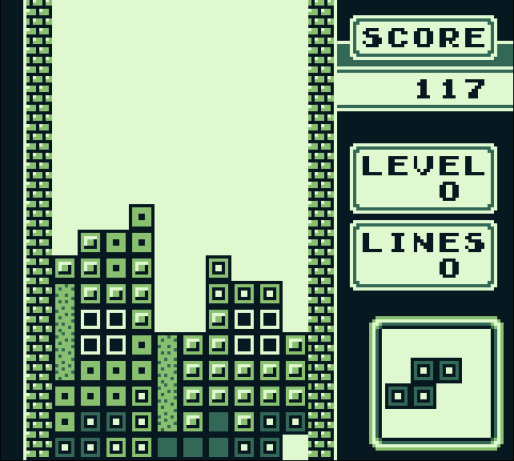

# gb
A DMG GameBoy emulator written in modern C. This is not a good representation of actual GameBoy hardware functionality, but rather my attempt at making it somewhat easy to understand.

This is also incredibly buggy, very few games work and all contain graphical errors but are playable.

## Screenshots
| DMG-ACID2 |   Catrap   | Tetris |
| ------------------------|------------------------|------------------------|
|  | | |

| The Legend of Zelda | Pacman |
| ------------------------|-----------------------|
|  | 
